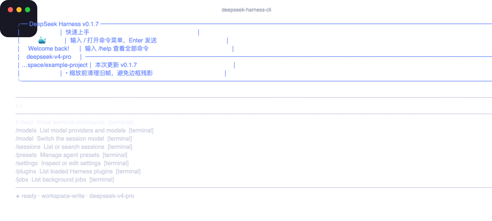

# deepseek-harness-cli

这是 [DeepSeek Harness](https://github.com/deepseek-ai/deepseek-harness) 的 Claude Code 风格终端界面。它不复制、不修改 Web 端，而是把终端操作映射到官方 `dsh` 使用的同一组 Harness 服务。



## 主要能力

- Ink 交互式终端界面，以及横向、扁平的 DeepSeek 鲸鱼头图。
- 输入 `/` 后，命令菜单从输入框向下展开；方向键选择，Enter 确认。
- 输入 `@` 可选择正在运行的子代理。
- 支持持久化会话、新建、恢复、重命名、全文检索、导出、工作区切换、图片附件、后台任务、Skills、子代理、审批、结构化提问、模型、凭据、Agent 预设、设置、插件、会话统计和消息反馈。
- `/permission`、`/plan`、`/goal`、`/feedback`、工作流以及插件贡献的命令，直接使用 dsh 动态命令注册表，不做假实现。
- 原有 `dsh web` 完整保留；终端版使用独立的 `dsh-cli` profile，互不覆盖。

## 环境要求

- macOS、Linux 或 Windows 终端
- Node.js 22 或更高版本
- `npm` 和 `pnpm` 均可在终端直接执行
- `@deepseek-ai/dsh` 版本不低于 `0.1.0-rc.6`，且低于 `0.2.0`

## 安装

先安装官方 dsh，再安装本项目：

```bash
npm install -g @deepseek-ai/dsh
npm install -g https://github.com/Richard-Yang0130/deepseek-harness-cli/archive/refs/heads/main.tar.gz
```

两条命令分别执行，一行一条。如果本机已经安装了兼容版本的 dsh，第一行可以跳过。

进入希望 DeepSeek 操作的项目目录，然后直接输入：

```bash
dsh-cli
```

首次启动时，`dsh-cli` 会自动创建独立的 `dsh-cli` profile，并把终端 bundle 安装进去；以后会直接复用。这个过程不会改动 Web profile，也不会影响原来的 `dsh web`。

也可以带首条任务、恢复历史会话或只做环境检查：

```bash
dsh-cli "检查这个仓库"
dsh-cli --resume <session-id>
dsh-cli doctor
```

`doctor` 只检查 dsh 版本和 profile 状态，不会启动交互界面。

## 基本操作

- Enter：发送当前输入。
- `/`：在输入框下方打开命令菜单。
- ↑ / ↓：选择命令；Enter：补全；Esc：关闭菜单。
- `@`：打开子代理菜单。
- Ctrl+C：运行中取消当前轮；空闲时退出。
- 非 TTY 输入会自动使用行模式，但调用的是同一个控制器和同一组 Harness 服务。

常用命令：

```text
/new                              新建持久化会话
/sessions [query]                 列出会话或全文检索
/resume <session-id>              恢复会话
/rename <title>                   修改会话标题
/models                           列出 Provider 和模型
/model <provider> <model>         切换当前会话模型
/presets                          列出 Agent 预设
/presets read <id>                查看预设组成
/presets copy <from> <id> [name]  复制为可编辑预设
/presets remove <id>              删除用户预设
/preset <id>                      用指定预设开启新会话
/settings                         查看脱敏设置
/settings set <ns> <path> <json>  修改设置
/settings unset <ns> <path>       删除设置覆盖
/credentials status <ref>         查看凭据状态，不显示值
/credentials set <ref> <env>      从环境变量安全写入
/credentials unset <ref>          删除可写凭据
/workspace <path>                 切换工作区并新建会话
/attach <image-path>              给下一条消息附加图片
/jobs                             查看后台任务
/job-read <job-id>                读取任务输出
/job-kill <job-id>                停止任务
/stats                            查看完整会话统计
/message-feedback ...             管理单条助手消息反馈
/trajectory                       查看持久化事件轨迹
/export [path]                    导出会话树和附件 ZIP
/plugins                          查看实际加载的插件
```

完整说明见 [命令参考](docs/commands.md)、[Web → 终端能力映射](docs/capability-matrix.md) 和 [故障排查](docs/troubleshooting.md)。

## 凭据使用示例

为了避免密钥出现在命令、回显或 README 中，终端版不会接收明文密钥参数。先在启动 `dsh-cli` 的 shell 中设置一个临时来源变量：

```bash
export SOURCE_DEEPSEEK_KEY='你的密钥'
dsh-cli
```

再在界面内执行：

```text
/credentials set DEEPSEEK_API_KEY SOURCE_DEEPSEEK_KEY
```

程序只会显示“已保存”，不会输出密钥值。

## 设置修改示例

查看所有已注册、已脱敏的设置命名空间：

```text
/settings
```

写入一个 JSON 值：

```text
/settings set agent-presets default "standard"
```

撤销用户层覆盖，让它重新继承组合默认值：

```text
/settings unset agent-presets default
```

所有设置写入都经过 `SettingsProvider.mutate`，带 revision 冲突检查；不会直接修改 Harness 存储文件。

## 消息反馈

先列出当前会话已有反馈和可用的 message id：

```text
/message-feedback list
```

写入或更新反馈：

```text
/message-feedback put <message-id> positive 很有帮助
/message-feedback put <message-id> negative 这里需要修正
```

删除反馈：

```text
/message-feedback delete <message-id>
```

写入使用 MessageFeedbackService 的版本比较机制，避免覆盖并发修改。

## 与 Web 的关系

终端版和 Web 端共享以下核心：会话日志、模型路由、凭据、设置、权限、Agent 预设、命令、工具、Skills、子代理、后台任务、工作流、附件、反馈和投影统计。Web 专属的鼠标布局、浏览器下载弹窗等视觉交互，在终端中替换为等价的命令和文本呈现。

本项目只包含终端代码、启动器、Cordis patch、测试和文档。用户仍需单独安装官方 dsh。

## 更新与卸载

GitHub 安装方式通过重新安装更新：

```bash
npm install -g https://github.com/Richard-Yang0130/deepseek-harness-cli/archive/refs/heads/main.tar.gz
```

卸载终端命令：

```bash
npm uninstall -g deepseek-harness-cli
```

独立 profile 默认保留在 `$HOME/.dsh/profiles/dsh-cli`，便于以后重装继续使用。需要彻底清理时，可在确认路径后自行删除该目录。

## 项目性质

这是独立的社区终端界面，不是 DeepSeek 官方发布。项目依赖官方 `@deepseek-ai/dsh`，遵循其公开服务接口。许可证为 MIT。
